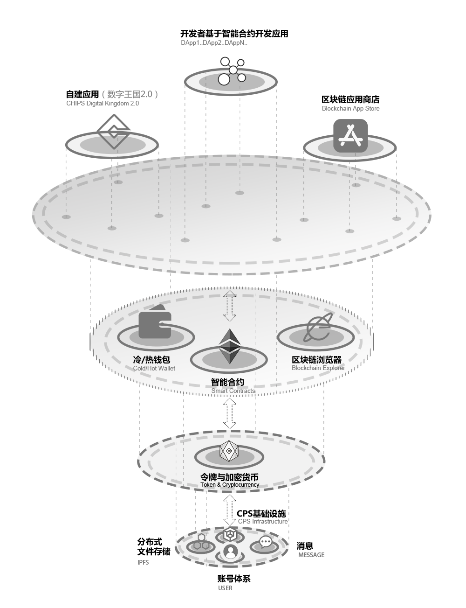

# CPS 技术白皮书

__2018年1月31日 版本号：2.0__

版权所有 © 2018 Chips Limited

注：任何个人可不经授权将本白皮书用于非商业行为，只需要引述上述版权声明即可。

# 免责声明
本白皮书只供传递技术相关的信息，不构成投资建议。任何个人或团队不得将本白皮书用于商业目的。
1. 虽然团队尽最大努力使本白皮书的内容尽可能准确地体现系统的设计及实现，但由于项目的技术代码在不断演进迭代中，因此，本白皮书并不保证与发布的代码或提供的服务完全一致。团队也不保证白皮书实时地反映代码的改变。
2. 作为免费开源项目，团队不对发布的代码及提供的服务的准确性提供保证。 __本项目只按照“原样”进行发布。__ 团队默认本白皮书、本代码库的使用者具备充分的法律知识、技术知识及开发能力以保障代码的正确、安全的运行。 __团队不对使用本项目代码所造成损失承担任何责任。__ 这些损失包括但不限于
    * 由于无法实现一个预期目标所造成的直接间接的损失
    * 由于本白皮书与本代码库的代码或者逻辑不一致所造成的直接间接的损失
    * 由于本代码库或本代码库相关的服务的错误或bug所造成的直接间接的损失
    * 由于本白皮书、本代码库、以及与本代码库相关的服务对第三方构成侵权所造成的直接间接的损失
3. __本白皮书、本代码库、以及与本代码库相关的服务，不构成任何投资建议。 任何个人或团队，未经授权不得擅自使用本团队、本团队成员、本白皮书撰写者及贡献者、本白皮书、本代码库的名义，进行任何形式的市场推广。任何个人或团队，未经授权，不得通过发布本团队、本团队成员、本白皮书撰写者及贡献者与第三方团队的不实信息。__
4. “CPS Coin”即“CPS 令牌”或“CPS代币”没有任何的权利、用途、目的、属性、功能或特性，明示或暗示的保证。
5. 本白皮书中的“将”“将要”“可能”等词语仅代表功能或性能上的预见性或者设计思路，不作为团队的承诺。

# 导语
我们阅读了海量的区块链项目白皮书。在架构选型时，我们大量学习了EOS.IO的构建方式，并在其白皮书中对其技术特性进行了深入挖掘。最终，CHIPS创始团队成员一致认为EOS.IO的技术特性高度符合《CPS商业白皮书》，后期我们将保持与EOS.IO版本同步更新的策略。

此外，由于近期EOS在多线程上的开发进度受到阻碍，我们会持续关注并跟进相关的进展。目前，我们暂时采用单线程模式，因为单线程足以支撑目前甚至是可见将来的用户体量。在合适的时机，我们会提升技术引擎，以稳定安全地应付更大规模的区块链网络应用。

以下将重点从技术角度对EOS.IO进行深入挖掘，并在《CPS商业白皮书》中对挖掘到的技术逻辑点进行一一对应的商业延伸介绍，并且在CPS Coin主干网络中埋下代码伏笔，用以高度配合CHIPS数字王国2.0版本的建立。

# 名词定义

## 操作系统：
一组可以支持计算机基本功能的软件，这些功能包括：任务调度、执行应用、控制周边设备、通讯。

## 区块链：
区块链是以分布式方式（即在没有中央数据库的情况下）实现，并且通常没有中央权威机构的不可改变（一旦发布，任何交易都不能改变）的数字账本系统。 最基础的区块链应用就是比特币，比特币使其用户能够在公共账本中记录交易信息，从而在用户间实现转账和价值交换。

## 加密货币：
加密货币是一类使用计算机密码学原理来确保交易安全的交易媒介的统称。广义的加密货币不局限于传统意义上“货币”应用，还包括通讯、确权、智能合约等功能和应用场景。

## 智能合约：
所谓的智能合约就是一段能够根据预先编好的代码执行一种用户间的条款，它由计算机自动执行，因而具备强制力。CPS系统允许任何用户根据软件的标准及协议运行智能合约。

## IPFS
IPFS是一套新兴的存储和可根据内容寻址文件的标准。“可根据内容寻址”是指根据文件的内容而不是网址(URL)或者文件名来查找文件。换句话说，“可根据内容寻址”一般是指根据一个文件的哈希值来查找文件。因为有哈希的机制，同样内容的文件就会具备相同的“文件名”。并且该文件的内容一旦确认，就不能更改，因为只要更改了文件的内容，文件名也会随之更改，也就是说这将是另一份文件了。此外，我们还可以通过文件名来校验文件内容，确保文件内容不被人为或非人为的因素所篡改。

IPFS又包含了一套类似于BT文件下载的P2P的文件共享机制。这大大提高了网络的传输速率。但是需要我们注意的是，任何P2P文件下载机制都无法保证文件的持久存储、可访问、或下载时具备足够的带宽。这其中，所谓的“无法持久存储”是指：一旦文件的最后的那份副本从网络上消失，那么用户将永远无法得到文件的内容，这是非常糟糕的。虽然无法保证文件的持久存储，但我们可以朝这个方向努力。所以我们希望能建立一套有效的激励机制，从而鼓励用户向区块链网络贡献自己的服务器以及带宽。

一言蔽之，IPFS类似于某些常用的第三方下载加速软件的分布式文件系统。

## 石墨烯
“石墨烯”（graphene）是一套区块链工具。它由比特股团队Cryptonomex开发，采用C++编写。“石墨烯”主要优势是并发能力强。基于“石墨烯”的BTS和STEEM可以使平均单笔交易速度缩短至1.5秒，以及在有限的硬件资源下实现每秒3300笔交易的数据吞吐量。这其中关键的原因是，石墨烯能通过并行链的方式可以达到更高的性能指标。

# 技术背景
第一代区块链技术比特币（BTC）实现了可信的分布式账本，第二代区块链技术以太坊实现了基于可信账本的智能合约。在智能合约的世界里，资产的权益及历史记录将被公开、可信、有效地记载，同时智能合约的“全节点”和“矿机”又确保智能合约得以强制有效地执行。这种铁面无私的执行力使得用户对区块链系统的功能、可靠性、效率有着更高的期望值。因而，现有的区块链系统在更高的期望面前暴露出如下局限性：
1. 功能限制：两者只适合构建围绕“交易事务”（transaction）为主的功能，如记账、投票、签名等系统。然而，区块链在其他领域的应用捉襟见肘。
2. 计算能力限制：智能合约所支持指令集有限。
3. 存储能力限制：区块链上无法存储更多的信息（否则将面临更高的交易手续。且数据的存储速度较慢，一个参考值是7秒/KB。
4. 无法高并发（scale）：现有主流区块链的运行机制使“分布式”带来的收益大为受限。由于智能合约必须同步在各个节点中运行，无论区块链运行时有多少个分布式的节点，其性能本质上相当于单一节点。这就使得单个主链无法支撑个别应用，更不要提支撑今后日益庞大的海量应用。
5. 高手续费：比特币及以太坊在问世时的令牌单价较低，没有预判到手续费大涨问题。比特币的手续费没有考虑到小额支付。一些其他区块链也有类似问题。
6. 粉尘攻击：垃圾数据、无效数据会给区块链的运转效率带来很多负面影响。偶尔出现的比特币的转账确认时间长，以太坊的拥堵等情况都可证明这一点。
7. 紧密耦合：区块链骨干网络与虚拟机紧密耦合，无法体现软件工程语境下的“分层”。

综上所述，以比特币为代表的第一代区块链和以以太坊为代表的第二代区块链已经不能解决用户日益增高的需求。因而，区块链世界需要更好的解决方案。

# 技术开发目标
本平台致力于打造一套具备如下特性的系统：
1. 支持海量的用户数: 像Baidu、Tencent、Google、Amazon这样的巨无霸级的系统，需要为上亿的用户提供稳健的系统支撑。考虑到麦特卡夫定律(麦特卡夫定律：一个系统的价值与其用户数的平方成正比），随着时间的发展，系统必将具备很强的延续性。
1. 并行计算：无论是单机的多线程、多核CPU，还是基于网络的高并发，系统需要提供一种分派任务的机制
1. 低延迟：低延迟是良好用户体验的最关键因素。
1. 良好的升级与错误修复机制：“凡是代码，必有bug”。因而，系统的升级也是很重要的一环。在涉及价值及交易的环节，需要及时修复bug以确保安全。同时，系统支持快速迭代与演进，以建设成为有机的自进化的生态。
1. 抗攻击：对于无效或非法的数据及消息，系统将更早地将其过滤掉，以提供更洁净的环境。

# 体系架构

CPS系统引入了一个新型的区块链体系以支持分布式应用程序（DApp）。该架构是CPS团队通过构建一个分布式的操作系统来实现的。本系统提供了账户、认证、异步通信与服务器集群的调度功能。最终，系统将会实现一个可实现高并发、支持快速部署、并且低成本的区块链体系架构。

在这一章中，我们将先描述CPS的基础设施架构，再逐渐向上描述CPS的应用层，最终讨论CPS的应用生态体系。

## 虚拟机
虽然虚拟机的技术实现细节与区块链的设计基本上是独立的，我们还是会在这里谈一下技术要点。只要是符合下列技术要点并且具备足够性能和沙盒安全性的虚拟机，都可以与本系统的API集成。

## 基础设施
本团队意识到许多不同的应用程序需要相同类型的功能，于是我们将这些共性的功能提炼出来，并由团队提供针对这些功能的官方实现。这些共性功能包括：应用程序所需的加密和通信工具、基于角色的权限。上述功能对于简化用户帐户的生成和管理，以及权限声明和帐户恢复等安全问题将尤其有用。团队以后可能还将提供用于接口开发的Web工具包、自描述接口、自描述数据库方案和声明性权限方案。

## 存储
### 分布式存储
CPS Coin存储是一个探索性的分散式文件系统，用户可以存储和托管能被主流浏览器所访问的文件。 我们知道，有一些其他的方案会收取初始费用，或者是根据存储文件的时间或带宽来收费。但是本方案不会采取这种模式。本方案只会收取一个可全额退还的押金。 用户在需要存储和带宽时需要持有令牌，当然，也能在不需要存储和带宽时转售令牌。区块的生产者（类似于“挖矿”）将会为令牌的持有者服务，这样，就形成了一套激励机制，确保闭环形成。

因为区块链的安全性和健壮性严重依赖于高度的冗余度，因而，它不适合存储大型的尤其是可能会被修改的文件。比如假定一条交易事务是50个字节，那么一个一秒中能生成十万条交易事务的区块链网络，对于每一个全节点就会带来每秒中增加5MB的负担，一分钟便可增加300MB。为了减少对存储空间的过分依赖，这些交易事务要么在硬盘上被压缩，要么每隔一段时间取一个当前快照，然后丢弃快照之前所有的历史记录。即便如此，区块链上的每个节点都被要求存储相同的内容，将会是资源的极大浪费。

为了解决这个问题，一些区块链的解决方案采取了用IPFS存储文件名，并将智能合约的交易事务打包起来存储在IPFS上，这样的好处就是减少了数据的冗余度，从而减少了对存储的需求。但是这个问题同样没有保证文件一直是可被访问的。因为IPFS本身并不保证文件是必须存在且可访问的。前面提到，如果网络上最后一份文件的副本不存在的话，就意味这个文件在整个IPFS上消失了。在BT网络上找不到想要的音视频资源尚且降低了用户体验；在涉及到信任和价值交换的区块链上，文件的丢失会造成更严重的事故，甚至导致全网的瘫痪。

### 存储上的隐私
本系统的存储是托管公共数据的平台。需要隐私的用户可以在上传文件之前将文件应用于加密算法。虽然加密文件的内容是私密的，但上传文件的区块链账户的身份标识仍然是公开的。

### 与对标产品的比较
我们已经有Google Drive, iCloud, Dropbox, 百度网盘等对标产品为用户提供上G的免费存储空间，付费用户可以得到更多的存储空间。但这些产品没有一个参考IPFS所使用的通用的文件命名系统，它们也不会集成一个开放P2P网络。这样，用户就会面临至少双重的风险：1.服务不可用；2.价格模式改变。在本系统中，由于采用了一个开放的IPFS系统，用户将面对更可靠的网络和计费模型。

## 通信
区块链上的主机可以运行在任何连接因特网的环境，无论是路由器后面的物联网终端(比如家庭的局域网内部的冰箱），或是办公室通过端口映射的主机，还是数据中心的公开主机，都可以实现互联互通。这样一来既节省了配置成本，又从整体上提升网络的效能。

### 消息与数据库的元定义
由于本系统提供了一个范式（schema）机制，适用于消息与区块链自带的内部数据库。
* 消息必须包含一个范式（即一般是包含在消息头部的格式定义），无论是二进制消息还是JSON格式的消息就能够无缝对话。
* 同样地，数据库的状态必须也通过类似的范式。这样确保数据在呈现时是一个易读的JSON格式，但是在系统内部存储时或者变更时则是高效率的二进制。

### 延迟交易事务
只要在不同的数据库分片中通信，就必须会涉及到锁。延期交易通过最小化单一时间内获取锁的数量来提高性能。 目前除了已经实现了延迟交易事务，还将实现定期（指定将来某个时间点）的交易，以及取消先前所设立的定期交易。

定期交易（结合免费交易）使CPS的智能合约成为一个图灵完备合约。 只要智能合约具有足够的计算能力和带宽，合约就可以永久运行。 一些其他区块链，要么有手续费、要么在某个时间点需要外部输入，这就构成了某种限制。

### 延识消息传递
对于网络上的消息，我们收到时总会有些担心，消息有可能是无效的，也有可能在当前的交易的时间限制内无法执行完。另外，有时候我们会需要在一个消息中加入当前交易范围以外的信息。在上述情况下应用可以请求区块的产生方在下一个区块或者更以后发出消息（类似于异步机制），这样如果消息是正确有效的，那么你的应用程序会收到通知；反之，那么消息则不会被发出，且消息在超时后会被你的应用清空。

### 消息处理机制
本系统结合了自动消息处理程序和自描述的数据库体系。每个账户拥有自己的数据库，可以给其他账户发送结构化消息、可以定义消息被接收后的处理程序，且只能自己的消息处理程序访问，该消息处理程序还可以向其他账户发送消息。

## 共识算法
### 基于DPOS(授权的股权证明)的增量机制
为了能达到更高的性能及效率，本系统采用类似于EOS的DPOS算法。

DPOS是一种连续投票机制，在这种机制下，令牌的拥有者可以根据区块的生成情况选择区块的生成服务器。令牌的拥有者可以自主地选择，他们的投票将影响他们所收到的新增令牌的数目。而服务器之间会按照他们所收到的投票的数量等比例地分配新区块的共识增量令牌。

DPOS的最大优势在于：可以由相对少量的处理器来操作，而且不会造成网络安全问题。因为传统的POW区块链中，网络和应用程序的安全性大量依赖哈希值的结果，而这种结果又会消耗大量算力。POW的设计虽然保障了网络的安全性和鲁棒性，却给新进入的开发者带来了难度。当然，开发者对DPOS也存在别的顾虑。

## 账户体系
本系统具备完善的账户体系，账户的创建者可选择一定长度、人类可阅读的字符串作为名称，这与比特币，以太坊只有私钥和地址概念的账户系统相比，大大提高了可读性和大规模商用的可行性。账户的注册只需要很低的费用，就可以承担存储账户信息的成本。同时，帐户名称支持命名空间，因此“域名”的所有者是唯一可以创建“帐户名@域名”的用户。

### 基于角色的权限管理
判断一条消息是否被授权，最简单的形式是包含一个签名。通过签名我们可以知道这条消息是“谁授权的”“授了什么样的权”这两种信息。一般来说权限是与个体或群组绑定在一起的。多账户的控制机制能对账户的安全提供保障，减少因账户被黑而造成的资金损失的风险。

### 授权延迟
安全性的关键是时间。打个比方，如果我们在线下遭遇了电信诈骗，如果我们的银行转账系统有一定延时，那么我们至少能够提高钱被转走之前挽回的概率。CPS系统使用户能够根据不同权限级别配置不同的延迟。例如，发微博到社交媒体可以是即时的授权，而转账授权可能需要1天或更长时间的延迟。当用户尝试执行需要延迟的操作时，交易将被打包并推迟直到延迟截止期。并且交易在该期间可以被取消。

### 忘记密码的恢复
用户经常会忘记密码。本系统的密码恢复机制能一定程度上缓解用户的这种担忧。每个帐户都可以指定一些能够更新活动权限的恢复合作伙伴，但前提是用户的帐户在30天内不活动。 只要用户指定了一些账户作为恢复合作伙伴（一般是朋友和家人），那么即使在用户丢失了密钥时，那么ta依然能找回账户的所有权。那么用户就不再用担心账户被锁定。

通过结合社交网络、时间延迟和密码学，让用户重新拥有丢失的账户的所有权成为可能，这样CPS就建立了一个保护所有用户财产权的信任网络。

### 被黑帐户的恢复
每个帐户都有三个特殊权限：所有者权限、活动权限、恢复权限。 所有者权限应该配置为多个私钥，并且有权更改所有其他权限。使用所有者的权限将要求用户及其恢复合作伙伴（一般是用户最信任的朋友或亲人）同时同意。 在实践中，这形成了所有用户之间的一个信任网络，这样使得黑客成功入侵的概率大大降低，因为之前黑客只需要侵入一个账户，但现在却需要侵入整个网络。

另一种情况：如果恢复合作伙伴决定不授权，用户还可以选择延迟30天以更新所有者许可权限。（每两次更新所有者权限之间至少需要30天，不能太频繁，以保障安全。）
 
只有一种情况会比较糟糕：即黑客获得密钥的同时，用户自己丢失了活动密钥。这可以通过备份冗余密钥的安全策略来避免。

## 网络的可扩展性
对于一个商业平台，可扩展性是至关重要的。以以太坊为代表的2.0版区块链体系的一个关键限制在于：无论整个网络有多少个节点，其性能上限不会超过单线程CPU性能。通过优化，最多每秒100笔。然而，在真实的应用程序负载下，以太坊网络当前的交易可能会被限制到每秒10笔或者更低。长此以往，网络已经被洪水般的交易信息淹没，以至于只有支付了高额手续费的交易才被接受。比如最近由于养猫这款APP的流行，以太坊遭遇到了大面积的崩溃。好在，以太坊的开发者已经制定了一个致力于提升网络扩展性的路线图，只是该路线图严重依赖数据库的分片。本团队认为：分片是一个技术上具有挑战性的概念，无疑会增加网络的复杂性和攻击范围，并可能降低网络的安全性。因此在这一场景下，分片并不可取。

在可扩展性方面，本系统有两个显著优势：首先，我们会借鉴已经在压力测试中被证明的EOS的石墨烯技术，该技术具备每秒1万至10万笔交易处理能力。其次本系统将使用并行化来扩展网络，或将达到每秒数百万次的交易处理能力，这种能力将支撑数千个企业级的DAPP。本系统还将使用异步通讯方式并将认证与执行过程分离来实现加速。

### 并行
前面提到，以现行主流区块链技术构建的任意一条链的计算能力都不高于单台计算机（即使这台计算机的性能非常强劲），这显然无法适应互联网层面的多种应用需求，这也是直到今天区块链技术依然无法大规模应用于互联网其他领域根本原因（比如以太坊云养猫造成了网络拥塞）。与一些其他的区块链3.0一致，本团队同样认为:区块链的发展应放弃主链思维。

所谓放弃主链思维，并不是指放弃主链。主链依然存在，只是主链更纯粹——主链基础设施只为上层应用提供可信的服务，比如账号、存储、通信、交易确认，同时限制智能合约的执行。也就是说，我们为主链“减负”。

### 抗DOS攻击
由于本系统给予用户按比例的网络带宽、存储空间和运算能力，因此恶意攻击者只能消耗根据其代币占比所拥有的相应比例网络资源。DOS攻击或许在某个特定的应用程序中构成害，但是这些攻击永远不会扰乱中断整个网络。即使许多恶意的捣乱分子试图给几个大型的网络应用人为制造垃圾阻塞，也能保证网络上小用户依然享有足够的带宽和计算能力。

## 令牌模型和资源使用

### 谁使用，谁付费
一般地说，支付服务器、带宽和运营业务所需的其他资源需要成本。客户从商家购买特定的产品或服务，这些产品或服务的销售收入用于支付成本。

在互联网世界，大部分网站的没有要求普通的访客付费，（即使每多一位访客，网站就需要多支付一份服用器托管费用）。同样的道理，DApp们不应该强迫其客户直接支付而使用区块链。

但是别误会了，这里不是说DApp们应该全免费。用户平时在上网，所以向电信运营商(ISP)交了网费，因而用户在访问大多数网站（比如Google、Facebook、Amazon）时不需要付费，用户只需为增值服务付费。同样地，用户使用区块链，已经为其支付了一定的费用，因而不需要为使用区块链本身付费。但是商家可要求用户为增值服务付费。

简而言之，CPS上的DApp一般不要求其用户直接支付区块链的使用费——这句话只是一个一般模式，而不是强制性措施；即，CPS Limited不会限制或阻止DApp的开发者或运营企业收费。

### 出售剩余资源/共享经济
CPS Coin持有者既然持有令牌，就意味着享有相应比例的资源。但是大多数情况，他们不会立即需要占据这其中全部的可用资源，总会有些剩余。这个时候，CPS Coin持有人可以向其他用户提供或租用这些未消耗的资源（如带宽），以实现资源的有效利用。

### 奖励机制
本系统将在每次创建块时向生产者授予新的令牌（即CPS Coin）。 在这种情况下，创建的令牌数量由所有块生产者公布的期望收益的中位数决定。CPS系统是可被配置的，它可为对生产者奖励执行上限，使得令牌供应的年度总增长不超过一个最大增幅，以避免通货膨胀。

### 稳定的交易成本
由于最近的币市的大幅波动，那些与交易成本相关的问题又一次浮上来。如果令牌短期内价格上涨太大，那么用户可能就不大乐意使用服务，而是直接囤币。本系统的主要优点之一是DApp可用的资源完全独立于CPS Coin的价格。如果应用程序开发者或运营者在区块链上持有相应的CPS Coin，则应用程序可以在固定状态和带宽使用情况下无限期地运行。 在这种情况下，开发商和用户不会受到令牌市场任何价格波动的影响。

本系统每次产生区块时都会授予区块生产者令牌。令牌的价值将影响生产者能够购买的算力、带宽、和存储；令牌价格越高，愿意提供算力、带宽和存储的人就越积极，从而提高整体网络性能。

### 激励机制：持股而非消费
以太坊的每次计算、存储、带宽利用都需要GAS费用。此外，由于矿工优先选择收费最高的交易，所需费用波动可能高得惊人。在最近的一些活动中，即使是轻微的交易，等值为100美元的GAS费仍然不够用。此外，这个经济模型创造了一个场景，“富人”可以用高费用的交易淹没整个网络。第三，这种模式要求开发者和创业公司在整个应用程序的开发和部署过程中持续地收取费用，这对于他们的门槛相对较高。

相比之下，CPS将利用所有权模式，其中持有CPS Coin的用户在网络带宽，存储和计算能力方面的比例份额。 这意味着，如果某人拥有1％的CPS Coin，则无论网络其他部分的负载如何，他们总能获得1％的网络带宽。 通过这种方式，小公司可以购买相对较小的份额，以获得相对廉价的网络带宽和计算能力，并在需要扩大应用程序时简单地购买更多的CPS Coin。 此外，由于网络交易费用为零，除了首次购买CPS Coin外，没有网络开发成本。 然而，如果愿意，这些当然总是可以出售以回收最初的投资。

## 社区管理

### 不良数据和仲裁
本系统将结合智能合约与法律约束力的仲裁方式。根据网络提供的仲裁争议解决机制，任何人都可以发起判定任意存储文件是非法的裁定，并且该文件将被删除如果对应的存储和托管违反法律或其他合同。

CPS存储协议将允许块生产者删除任何法律或仲裁要求删除的文件。并非全体块生产者都要遵守相同的法律法规。而是由令牌持有者的社区决定区块生产者是否在正确合理地删除文件。有不正当行为的生产者可以在区块链宪法的仲裁下被投票否决，从而失去生产者地位。

# CPS提供的设施
CPS团队提供以下设施、功能、或者服务，但是创业公司或开发者也可以自行搭建。

## 区块链浏览器
对于不同的人，区块链浏览器都有价值。对于普通用户，它能告诉用户转账是否被全网确认；对于开发者，它能帮助我们测试网络；对于交易所，它能显示当前流通中的令牌数量和总令牌数量。

开发团队已经将区块链浏览器部署在测试网络中，但是它将来将在正式网络（生产环境）中上线。

区块链浏览器现在包括如下功能：
* 列出所有块、交易事务、消息、帐户。
* 生产者（以方便了解块如何生产）。
* 包含ABI的账户以及与账户相关的交易清单。

在以后的版本中，将包括如下：
* 增加与区块链使用和性能相关的图表
* 改善移动端用户体验

## 热钱包
之所以推出热钱包，是为了能够更好地提升用户体验。普通用户，尤其是哪些初次接触区块链的用户，比较熟悉传统的中心化的账号及余额管理体系。他们一方面不熟悉“私钥”，但比较熟悉传统的中心化的账号及余额管理体系。

# 结语
本团队打算构建一套基于CPS区块链操作系统的生态系统。其中，应用层是一个生态设施完备的区块链分布式系统；底层的CPS系统为我们自建的生态系统和外界开发者提供了数据库、账号许可、调度、认证和互联网应用通信等服务，该底层系统极大地提高了区块链应用的开发效率。DAPP能从浏览器访问，或者从APP商店里下载。我们将建立一套开发者激励机制，以促使更多的开发者持续创造更高价值的去中心化应用，从而构建面向区块链开发者社区的正向反馈生态。我们真诚邀请社区共同建设CHIPS数字王国2.0版本，感谢您的关注与支持。

