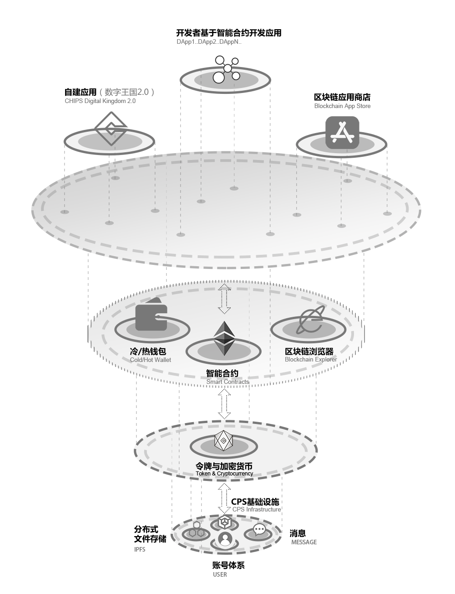
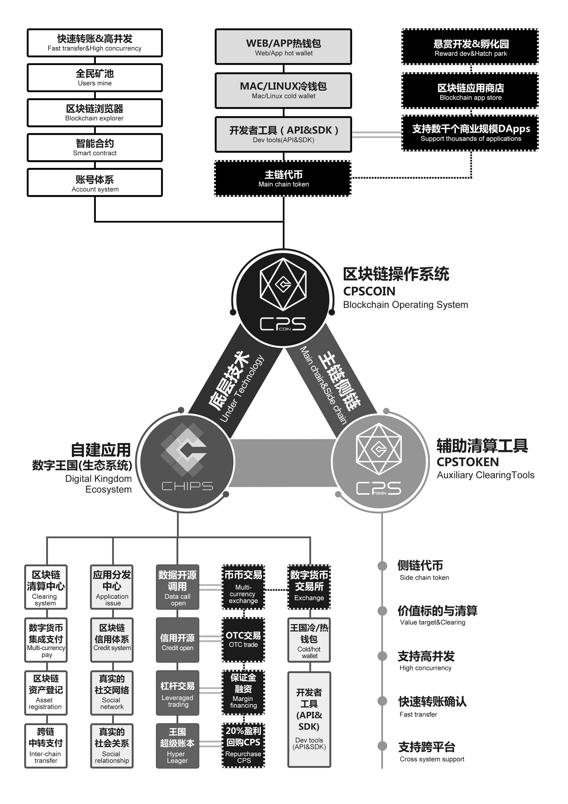

# CPS Technology White Paper

March 2018 ver 2.01

Copyright © 2018 Chips Limited

Note: Any individual may use this white paper for non-commercial purposes without explicit prior authorisation from the CPS team, as long as the above copyright notice is quoted.

# Disclaimer
This white paper is intended to convey technology-related information only and does not constitute investment advice. No individual or organization may use this white paper for commercial purposes.

1. Although the CPS team (hereinafter, "the team") does its utmost to make the contents of this white paper as accurate as possible in the design and implementation of the system, this white paper does not guarantee the release of the code or services provided because the technical code of the project is continuously evolving. Also, the team does not guarantee that the white paper reflects the changes in the code in real time.

2. As a free open source project, the team does not guarantee the accuracy of the released code and the services provided. __This project is only released "as is".__ The team defaults readers of this white paper and users of the software have sufficient legal knowledge, technical knowledge and development capabilities to ensure the correct and safe operation of the code. __The team shall not be liable for any loss caused by using this project code.__ These losses include, but are not limited to:

    * Direct or indirect losses due to failure to achieve an expected goal
    * Direct or indirect losses due to inconsistency between this white paper and the actual code
    * Direct or indirect losses due to errors or bugs in the software or related services  
    * Direct or indirect losses caused by infringement of third parties due to this white paper, the software, and services related to the software

3. This white paper, the software, and the software services associated do not constitute any investment advice. Any individual or team, without authorization, may not use any name of the team, members of this team, this white paper author and contributors, white papers, and the software for any form of marketing. No individual or team, without authorization, may not publish false information about the team, the team members, the white paper writer and contributors, and the third party team.

4. __"CPS Coin" means "CPS Token" or "CPS Token" without any right, purpose, property, function or characteristic, explicit or implicit.__

5. The words "to be", "to be", and "possible" in this white paper only represent functional or performance predictability or design ideas, but not as any form of commitments from the team.

# Introduction

We have examined massive blockchain project white papers. As we are selecting the architecture, we learned a lot about from EOS, and we dig deeper into its technical characteristics described in its white paper. As a result, CPS team members agreed that the technical characteristics of EOS.IO are highly consistent with our goals, and we will maintain the strategy of synchronizing with the EOS.IO version later.

In addition, due to the recent delay in the development of multi-threaded EOS development, we will continue to monitor and follow-up related progress. Currently, we will adopt the single-threaded mode for the time being, because a single thread is enough to support the current user volume even visible in the future. At the right time, we will upgrade the technology engine to handle the larger blockchain network applications in a stable and safe manner.

The following will focus on the potentials of CPS code from a technical perspective. Besides, we will walk through keypoints along with their implications in the CPS Business Whitepaper. Regarding the CPS backbone network, we will also build a highly elastic architecture . All these measures will be taken to establish the Digital Kingdom envisioned in the CPS Ecosystem v2.0.

# Terminology

## Operating System:
A set of software that can support basic computer functions, including: task scheduling, execution of applications, control of peripheral devices, and communication.

## Blockchain:
Blockchains are immutable digital ledger systems implemented in a distributed fashion (i.e., without a central repository) and usually without a central authority. At their most basic level,  they enable a community of users to record transactions in a ledger that is public to that community, such that no transaction can be changed once published. The most significant blockchain product so far is Bitcoin.

## Cryptocurrency:
Cryptocurrency is a generic term for a type of transactional medium that uses computer cryptography to ensure transaction security. The generalized cryptocurrency is not limited to the traditional "currency" application, but also includes functions and application scenarios such as communication, confirmation of rights, and smart contracts.

## Smart Contract:
A so-called smart contract is a clause that can be executed according to a pre-programmed code. It is automatically executed by a computer and is therefore mandatory. The CPS system allows any user to run smart contracts based on the software's standards and protocols.

## IPFS
IPFS is a set of emerging standards for storage and content-addressable files. "Addressable according to content" refers to finding a file based on its contents instead of a URL or a file name. In other words, "addressable according to content" generally refers to finding a file based on the hash value of a file. Because of the hash mechanism, files with the same content will have the same "file name." And once the content of the file is confirmed, it cannot be changed because the file name will change as long as the content of the file is changed, which means that this will be another file. In addition, we can verify the content of the file by its file name to ensure that the content of the file is not tampered with by human or non-human factors.

IPFS also contains a P2P file sharing mechanism similar to BT file download. This greatly increases the transmission rate of the network. However, we need to pay attention to the fact that any P2P file download mechanism cannot guarantee sufficient bandwidth for persistent storage, accessibility, or download. Among them, the so-called "cannot be persistent storage" means that once the last copy of a file disappears from the network, the user will never be able to get the contents of the file, which is very bad. Although we can't guarantee the long-term storage of files, we can work hard in this direction. Therefore, we hope to establish an effective incentive mechanism to encourage users to contribute their own servers and bandwidth to the blockchain network.

In a nutshell, IPFS is similar to the distributed file system of some commonly used third-party download acceleration software.

## Graphene
Graphene is a set of blockchain tools. It was developed by the BitShares team Cryptonomex and written in C++. The main advantage of "graphene" is its ability to perform concurrently. The graphene-based BTS and STEEM can reduce the average single transaction speed to 1.5 seconds and achieve a data throughput of 3,300 transactions per second with limited hardware resources. The key reason for this is that graphene can achieve higher performance through parallel chains.

# Technical background
The first generation of blockchain technology Bitcoin (BTC) realized a trusted distributed ledger and Ethereum of the second generation of blockchain technology realized smart contracts based on trusted ledgers. In the world of smart contracts, the rights and historical records of assets will be recorded in an open, credible and effective manner. At the same time, the “full nodes” and “miners” of smart contracts ensure that smart contracts are enforced and enforced effectively. This kind of selfless executive force makes users have higher expectation of the function, reliability and efficiency of the blockchain system. Thus, the existing blockchain system exposes the following limitations in the face of higher expectations:

1. Functional limitations: Both are only suitable for building functions that are centered around "transactions", such as billing, voting, and signatures. However, the use of blockchains in other areas is stretched.

2. Computational Capabilities: There are limited instruction sets supported by smart contracts.

3. Storage capacity limitation: The blockchain cannot store more information (otherwise it will face higher transaction procedures. And the data storage speed is slower. A reference value is 7 seconds/KB.

4. Cannot be highly scaled: The operating mechanism of existing mainstream blockchains has greatly limited the benefits of “distributed”. Since smart contracts must run synchronously on each node, no matter how many distributed nodes the blockchain runs, its performance is essentially equivalent to a single node. This makes it impossible for a single main chain to support individual applications, not to mention supporting the ever-growing masses of applications in the future.

5. High fees: Bitcoin and Ethereum have lower unit prices when they come out, and there is no pre-judgment of the issue of rising fees. Bitcoin's handling fee does not take into account small payments. Some other blockchains have similar problems.

6. Dust attack: Spam data and invalid data will have many negative effects on the operational efficiency of the blockchain. Occasional Bitcoin transfer confirmation time is long, Ethereum's congestion and other conditions can prove this point.

7. Tight coupling: The blockchain backbone network is tightly coupled with the virtual machine and cannot represent the “layering” in the context of software engineering.

To sum up, the first-generation blockchain represented by Bitcoin and the second-generation blockchain represented by Ethereum cannot solve the ever-increasing user demand. Therefore, the blockchain world needs better solutions.

# Technology Development Target

The platform is dedicated to creating a system with the following features:
1. Number of Users Supporting Massive Users: Large-scale systems such as Baidu, Tencent, Google, and Amazon need to provide robust system support for hundreds of millions of users. Considering Metcalf's law (Metcalf's law: the value of a system is proportional to the square of its number of users), the system will have a strong continuity over time.
1. Parallel computing: Whether it is a stand-alone multi-threaded, multi-core CPU, or a network-based high concurrency, the system needs to provide a mechanism for dispatching tasks.
1. Low latency: Low latency is the most critical factor for a good user experience.
1. Good upgrade and bug fixing mechanism: "All code must be bug". Therefore, the upgrade of the system is also an important part. In the links involving value and transactions, bugs need to be fixed in time to ensure safety. At the same time, the system supports rapid iteration and evolution to build an organic, self-evolving ecosystem.
1. Anti-attack: For invalid or illegal data and messages, the system will filter it out earlier to provide a cleaner environment.

# Architecture

The CPS system introduces a new blockchain architecture to support distributed applications (DApps). The architecture is implemented by the CPS team by building a distributed operating system. The system provides account, authentication, asynchronous communication and server cluster scheduling functions. In the end, the system will implement a blockchain architecture that can achieve high concurrency, support rapid deployment, and low cost.

In this chapter, we will first describe the infrastructure of CPS, then gradually describe the application layer of CPS, and finally discuss the application ecosystem of CPS.

## Virtual Machine
Although the technical implementation details of the virtual machine and the design of the blockchain are basically independent, we will talk about the technical points here. As long as it is a virtual machine that meets the following technical points and has sufficient performance and sandbox security, it can integrate with the system's API.

## Infrastructure
We recognizes that many different applications require the same types of functionalities, such as implementations of the cryptography and  communication tools. Keeping that in mind, we will feature the introduction of generalized role-based permissions, a web toolkit for interface development, self-describing interfaces, self-describing database schemes, and a declarative permission scheme. As a result, these functionalities will be especially powerful for simplifying user account generation and management, as well as security issues like declarative permissions and account recovery.

## Storage
### Distributed Storage
CPS Coin Storage is an exploratory, decentralized file system where users can store and host files that can be accessed by mainstream browsers. We know that there are some other options that charge initial fees, or charge based on the time or bandwidth of the stored file. However, this scheme will not adopt this model. This plan will only charge a fully refundable deposit. Users need to hold tokens when they need storage and bandwidth. Of course, they can resell tokens when storage and bandwidth are not needed. The producer of the block (similar to "mining") will serve the holder of the token, thus forming an incentive mechanism to ensure the formation of a closed loop.

Because the security and robustness of the blockchain relies heavily on high levels of redundancy, it is not suitable for storing large files, especially those that may be modified. For example, if a transaction transaction is 50 bytes, then a blockchain network that can generate 100,000 transaction transactions in one second will add 5MB per second to each full node. Increase 300MB. In order to reduce excessive reliance on storage space, these transaction transactions are either compressed on the hard disk, or take a current snapshot at regular intervals, and then discard all previous history of the snapshot. Even so, each node in the blockchain is required to store the same content, which will be a huge waste of resources.

In order to solve this problem, some blockchain solutions have adopted the use of IPFS to store file names and package smart transaction transactions on IPFS. This has the advantage of reducing data redundancy and thus reducing the Storage requirements. But this problem also does not guarantee that the file will always be accessible. Because IPFS itself does not guarantee that the file must exist and is accessible. As mentioned earlier, if the copy of the last file on the network does not exist, it means that the file disappeared on the entire IPFS. The failure to find the desired audio and video resources on the BT network has also reduced the user experience; in the blockchain involving trust and value exchange, the loss of files will cause even more serious accidents and even lead to paralysis in the entire network.

### Privacy on Storage
The system's storage is a platform for hosting public data. Users who need privacy can apply the file to the encryption algorithm before uploading the file. Although the contents of the encrypted file are private, the identity of the blockchain account that uploaded the file is still open.

### Comparison with Counterparts
We already have Google Drive, iCloud, Dropbox, Baidu SkyDrive and other couterparts to provide users with free storage space on G, and paying users can get more storage space. However, these products do not have a common file naming system that references IPFS and they will not integrate an open P2P network. In this way, users will face at least double risk: 1. The service is not available; 2. The price model changes. In this system, due to the adoption of an open IPFS system, users will face a more reliable network and billing model.

## Communication
The host on the blockchain can run in any Internet-connected environment, whether it is the Internet of Things terminal behind the router (such as a refrigerator inside a home LAN), or the host through which the office maps through the port, or the public host of the data center. Interconnection can be achieved. This will not only save configuration costs, but also improve the overall network performance.

### Meta-Definition of Messages and Databases
Since the system provides a schema mechanism, it is suitable for the internal database of messages and blockchains.
* The message must contain a paradigm (that is, a format definition that is generally included in the header of the message). It can be seamlessly talked whether it is a binary message or a JSON message.
* Similarly, the state of the database must also pass a similar paradigm. This ensures that the data is in an easy-to-read JSON format when rendered, but it is an efficient binary when it is stored internally or changed.

### Message Handling Mechanism
The system combines automatic message processing and self-describing database systems. Each account has its own database, can send structured messages to other accounts, can define the handler after the message is received, and can only be accessed by its own message handler. The message handler can also send messages to other accounts.

### Delaying Transaction Transactions
As long as you communicate in different database shards, locks must be involved. Deferred transactions improve performance by minimizing the number of locks acquired in a single period of time. In addition to the implementation of deferred transactions, a regular (specified future point-in-time) transaction will be implemented and the previously established regular transaction will be cancelled.

Regular trading (combining free trading) makes CPS's smart contract a Turing complete contract. As long as the smart contract has enough computing power and bandwidth, the contract can run permanently. Some other blockchains either have fees or require external input at some point in time, which constitutes some kind of restriction.

### Message Delivery
For the news on the Internet, we always have some concerns when we receive it. The message may be invalid or it may not be completed within the time limit of the current transaction. In addition, sometimes we will need to include information outside the current trading range in a message. In the above case, the application can request the producer of the block to issue a message in the next block or later (similar to the asynchronous mechanism) so that if the message is valid, then the application will receive a notification; otherwise, the message will not. Will be issued, and the message will be cleared by the application after timeout.

## Consensus Algorithm
### DPOS
In order to achieve higher performance and efficiency, the system uses a DPOS algorithm similar to EOS.

DPOS is a continuous voting mechanism. Under this mechanism, the owner of the token can select the block generation server according to the block generation conditions. The owner of the token can choose independently, and their vote will affect the number of new tokens they receive. The server allocates a new block of consensus increment tokens in proportion to the number of votes they receive.

The greatest advantage of DPOS is that it can be operated by a relatively small number of processors without causing network security problems. Because of the traditional POW blockchain, the security of the network and application depends heavily on the results of the hash value, and this result will consume a lot of computing power. Although the design of the POW has guaranteed the security and robustness of the network, it has brought difficulties to newly-entered developers. Of course, developers also have other concerns about DPOS.

## User Account System

The system has a perfect account system. The creator of the account can select a certain length and human-readable string as the name. This is greatly improved compared to Bitcoin, Ethereum, which has only the private key and address concept of the account system. The feasibility of sex and large-scale commercial use. The registration of an account requires only a very low cost and can bear the cost of storing account information. At the same time, the account name supports the namespace, so the owner of the "domain name" is the only user who can create "account name@domain name".

### Role-Based Rights Management
The simplest form of determining whether a message is authorized is to include a signature. By signing, we can know that the message is "who authorized" and "what rights were granted." In general, permissions are tied to individuals or groups. The multi-account control mechanism can guarantee the security of the account and reduce the risk of financial losses caused by the account being hacked.

### Delayed Authorization
The key to safety is time. For example, if we are under telecom fraud online, if our bank transfer system has a certain delay, then we can at least increase the probability that the money will be recovered before it is transferred. The CPS system enables users to configure different delays according to different privilege levels. For example, sending microblogging to social media can be an immediate authorization, and transfer authorization may require a delay of one day or more. When the user attempts to perform an operation that requires delay, the transaction will be packaged and postponed until the delay deadline. And the transaction can be cancelled during this period.

### Password Recovery
Users tend to forget passwords. The system's password recovery mechanism can relieve users of this concern to a certain extent. Each account can specify some recovery partners that can update the activity rights, but only if the user's account is inactive for 30 days. As long as the user specifies some accounts as recovery partners (generally friends and family), then even if the user loses the key, ta can still recover the ownership of the account. Then the user no longer has to worry about the account being locked.

By combining social networking, time delays, and cryptography, it is possible for users to regain ownership of lost accounts, so that CPS has established a trust network that protects all users' property rights.

### Recovery of Hacked Accounts
Each account has three special rights: owner rights, activity rights, and recovery rights. The owner permissions should be configured as multiple private keys and have the right to change all other permissions. The use of the owner's rights will require that the user and his recovery partner (usually the user's most trusted friend or relative) agree at the same time. In practice, this forms a trust network among all users, which greatly reduces the probability of successful intrusion by hackers, because hackers only need to invade an account before, but now they need to intrude into the entire network.

In the other case: If the recovery partner decides not to authorize, the user may also choose to delay the 30-day update of the owner's permission. (It takes at least 30 days between two times to update owner rights, not too often to protect security.)
 
Only one kind of situation is worse: that is, when the hacker obtains the key, the user himself loses the activity key. This can be avoided by backing up the redundancy key's security policy.

## Extensibility
For an internet platform, scalability is crucial. A key limitation of version 2.0 of the blockchain system represented by Ethereum is that no matter how many nodes exist in the entire network, the performance limit will not exceed the single-threaded CPU performance. Through optimization, up to 100 pens per second. However, under real application load, the current transaction of Ethereum may be limited to 10 or less per second. Over time, the Internet has been flooded with flood-traffic information, so that only transactions that paid a high fee were accepted. For example, due to the popularity of this cat app APP, Ethereum encountered a large area of  collapse. Fortunately, Ethereum developers have developed a road map dedicated to improving network scalability, but the road map relies heavily on database sharding. The team believes that sharding is a technically challenging concept that will undoubtedly increase the complexity and attack scope of the network and may reduce the security of the network. Therefore, fragmentation is not desirable in this scenario.

In terms of scalability, this system has two significant advantages: First, we will draw on the graphene technology of EOS, which has been proven in stress tests, with 10,000 to 100,000 transaction processing per second. Second, the system will use parallelization to extend the network, or will reach transaction processing capacity of millions of times per second, which will support thousands of enterprise-level DAPPs. The system will also use asynchronous communication and separate the authentication and execution process to achieve acceleration.

### Parallelism
As mentioned earlier, the computational power of any one chain built with the current mainstream blockchain technology is not higher than that of a single computer (even if the performance of this computer is very strong), which obviously cannot adapt to the multiple application requirements at the Internet level. It is also the fundamental reason why blockchain technology is still not widely used in other areas of the Internet until today (such as the Ethernet congestion caused by cats). Consistent with some other blockchain 3.0, this team also believes that the development of blockchain should abandon the main chain thinking.

The so-called abandonment of the main-chain thinking does not mean giving up the main chain. The main chain still exists, but the main chain is purer - the main chain infrastructure only provides trusted services for upper applications, such as account number, storage, communication, transaction confirmation, and limits the execution of smart contracts. In other words, we "reduce our burden" on the main chain.

### Anti-DOS Attack
Because the system gives users proportional network bandwidth, storage space, and computing power, malicious attackers can only consume corresponding proportions of network resources based on the proportion of their tokens. DOS attacks may be harmful in a particular application, but these attacks never disrupt the disruption of the entire network. Even if many malicious scammers try to artificially create garbage blocking for several large-scale network applications, they can ensure that small users on the network still enjoy sufficient bandwidth and computing power.

## Token Models and Resource Usage

### Users Pay
In general, payment servers, bandwidth, and other resources needed to run the business require costs. Customers purchase specific products or services from merchants whose sales revenue is used to pay for costs.

In the Internet world, most websites do not require ordinary visitors to pay, (even if there is one more visitor, the site will need to pay an additional hosting fee). By the same token, DApps should not force their customers to pay directly and use blockchains.

But don't get me wrong, this is not to say that DApps should be free. Users usually access the Internet, so they pay network fees to their ISPs. Therefore, users do not need to pay for accessing most websites (such as Google, Facebook, and Amazon), and users only pay for value-added services. Similarly, users have paid a certain fee for using the blockchain and therefore do not need to pay for using the blockchain itself. However, merchants may require users to pay for value-added services.

In short, DApps on CPS generally do not require their users to directly pay for the use of the blockchain - this is only a general model, not a mandatory measure; that is, Chips Limited will not limit or prevent the development of DApps. Or operating company charges.

### Sale of Remaining Resources/Sharing Economy
Since the CPS Coin holder holds the token, it means that it has a corresponding proportion of resources. But in most cases, they will not immediately need to occupy all of the available resources. There will always be some surplus. At this time, the holders of CPS Coin can provide or rent these unconsumed resources (such as bandwidth) to other users for effective use of resources.

### Bonus System
The system will grant the producer a new token (ie CPS Coin) each time a block is created. In this case, the number of tokens created is determined by the median of the expected returns announced by all block producers. The CPS system is configurable to reward producers for enforcement caps such that the total annual growth in token supply does not exceed a maximum increase to avoid inflation.

### Stable Transaction Costs
Due to the recent volatility in the currency market, issues related to transaction costs have once again surfaced. If the price of the token rises too much in the short term, then the user may not be willing to use the service, but instead direct the money. One of the main advantages of this system is that the resources available to DApp are completely independent of the price of CPS Coin. If an application developer or operator holds the corresponding CPS Coin on the blockchain, the application can run indefinitely under fixed conditions and bandwidth usage. In this case, developers and users will not be affected by any price fluctuations in the token market.

The block producer token is granted each time the system generates a block. The value of the token will affect the power, bandwidth, and storage that the producer can purchase; the higher the token price, the more active the person who is willing to provide power, bandwidth, and storage, thereby improving overall network performance.

## Incentives: stakeholder v.s. consumer

With Ethereum, gas fees are required in exchange for every calculation, storage operation, and bandwidth utilization. Secondly, the required fees fluctuate and can spike prohibitively high as miners preferentially select transactions with the largest fees. This was especially obvious during recent cases, in which $100 gas fees were still not enough even for trivial transactions. Furthermore, this economic model creates a scenario where the rich can potentially freeze the entire network by flooding it with high-fee transactions. Thirdly, this model requires developers and startups to continuously burn gas fees throughout development and deployment of their applications.

In contrast, CPS will utilize an ownership model, in which holding more CPS Coin gives users a proportional advantage in consuming the network bandwidth, storage, and computing power. In other words, if someone owns 1% of the CPS Coin, they will always have access to 1% of the network bandwidth, regardless of the load on the rest of the network. In this way, small startups and developers can purchase a relatively small part of the network in order to receive reliable, predictable network bandwidth and computing power, and simply purchase more CPS Coins when they need to scale up their application. Furthermore, because of the zero fee, there is no network development cost, except for the initial purchase of CPS Coins. However, these CPS Coins can of course be sold at any  time in order to reclaim the initial investment if desired.

## Community Management

### Arbitration and Correcting Corrupt Data
The system will combine smart contracts with legally binding arbitration methods. According to the arbitration dispute resolution mechanism provided by the network, anyone can initiate a ruling that an arbitrary storage file is illegal, and the file will be deleted if the corresponding storage and hosting is in violation of a law or other contract.

The CPS storage protocol will allow block producers to delete any files that are required by law or arbitration to be deleted. Not all block producers must comply with the same laws and regulations. Instead, the community of token holders decides whether or not the block producer is deleting the file correctly and reasonably. Producers with improper behavior may be rejected under the arbitration of the blockchain constitution and lose their status as producers.

# Facilities provided by CPS
The so-called "facilities" refer to Web applications related to the CPS blockchain system. In other words, "facility" includes both blockchain code and Web-side code.

The CPS team provides the following facilities. Startup companies or developers can also build their own facilities.

## Blockchain Browser
For different people, blockchain browsers have value. For the average user, it can tell the user whether the transfer is confirmed by the entire network; for developers, it can help us test the network; for the exchange, it can show the current number of tokens in circulation and the total number of tokens.

The development team has deployed the blockchain browser on the test network, but it will come online in the official network (production environment).

The blockchain browser can now display the following information:
* All blocks, transaction transactions, messages, accounts
* Producer (to facilitate understanding how blocks are produced)
* Total current tokens in circulation

In future releases, the following improvements will be included:
* Increase chart related to blockchain usage and performance
* Improve mobile user experience

## Hot Wallet
The reason for introducing a hot wallet is to better enhance the user experience. Ordinary users, especially those who have first contacted the blockchain, are more familiar with the traditional centralized account and balance management system. On the one hand, they are not familiar with the "private key", but they are more familiar with the traditional centralized account and balance management system. Although the system already provides a set of account management systems at the blockchain level, users may need a “traditional” web-based wallet at the same time. For first-time users, such a hot wallet is enough. For high-end users, they need a convenient hot wallet in addition to a cold wallet to ensure safety, for daily micro-payment transfers.

Once online, the hot wallet will include the following basic features of the hot wallet:
* Account Registration, Login, Retrieve
* Display CPS Coin balance
* Transfers
   * Multi-factor authentication is required for roll-out logic to improve security
   * Need to create an address for each user

In addition, the hot wallet will also have the following features
* Display the current polled producer of the token in the wallet

## Other Facilities
In the future, CPS will also provide facilities such as exchanges. In addition, we wholeheartedly welcome community developers to submit excellent facilities. If the facility submitted by the developer can pass the code review and test, then the facility will have the opportunity to be upgraded to become the official designated facility of CPS to better reward the community.

# Conclusion
The team intends to build an ecosystem based on the CPS blockchain operating system. Among them, the application layer is a blockchain distributed system with complete ecological facilities; the underlying CPS system provides databases, account permissions, scheduling, authentication, and Internet application communication services for our self-built ecosystems and external developers. The underlying system greatly improves the development efficiency of blockchain applications. DAPP can be accessed from the browser or downloaded from the APP store. We will establish a set of developer incentives to encourage more developers to continue to create higher-value decentralized applications, thus building a positive feedback ecosystem for the blockchain developer community. We sincerely invite the community to collectively build CHIPS Digital Kingdom 2.0. 

Thank you for your attention and support!

